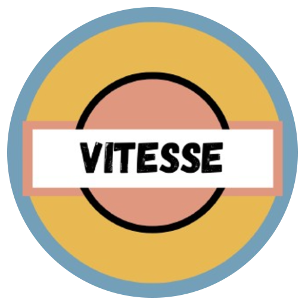

  

# Vitesse App

Application Android moderne de gestion de candidatures pour l’entreprise **Vitesse**.

Développée en **Kotlin** avec **Jetpack Compose**, cette application s’appuie sur une architecture robuste **MVVM**, avec **Hilt**, **Room** et **Retrofit**.

---

## 🚀 Présentation du projet

**Contexte** :  
L’entreprise automobile **Vitesse** souhaite moderniser son processus de recrutement à travers une application mobile.  
Cette application permet de gérer efficacement les candidatures, avec des fonctionnalités avancées comme la **conversion des salaires en différentes devises** et la **gestion de favoris**.

**Mission** :  
- Créer une interface moderne et intuitive avec Jetpack Compose.
- Intégrer des technologies Android récentes (Hilt, Room, Retrofit).
- Permettre l’ajout, la modification et la suppression de candidats.
- Offrir une expérience multilingue (FR / EN).
- Convertir dynamiquement les salaires selon les **taux de change** actuels.
- Ajouter une gestion de **favoris** pour suivre certains candidats.
- Rédiger des tests unitaires ciblés sur la logique métier.

---

## ⚙️ Fonctionnalités principales

- 📋 Liste interactive des **candidats**.
- ➕ **Ajout / modification / suppression** d’un candidat.
- ⭐ Marquer un candidat comme **favori**.
- 🌍 **Conversion du salaire** via une API REST (taux de change en temps réel).
- 💾 **Stockage local** avec Room (Entity, DAO).
- 🔌 Utilisation de **Retrofit + Moshi** pour les appels API.
- 🧠 Architecture **MVVM** avec **Hilt** pour la DI.
- 🗣️ Interface **multilingue** (français / anglais).
- 🧪 **Tests unitaires** des ViewModel et de la logique métier.

---

## 📈 Tâches réalisées

| Étape                         | Objectifs                                                        | Résultats                                      |
|------------------------------|------------------------------------------------------------------|------------------------------------------------|
| **Initialisation du projet** | Mise en place de l’architecture MVVM, DI avec Hilt               | Base de code propre, modulaire                 |
| **UI Design**                | Écrans modernes avec Jetpack Compose                             | Navigation fluide, UI intuitive                |
| **Gestion des données**      | Stockage local avec Room                                         | Candidats persistés localement                 |
| **Favoris**                  | Suivi des candidats importants                                   | Favoris visibles et persistés                  |
| **Appels REST**              | Récupération des taux via Retrofit + Moshi                       | Conversion dynamique des salaires              |
| **Multilingue**              | Support FR/EN                                                    | UI adaptative selon la langue du système       |
| **Tests unitaires**          | Couvrir ViewModel et logique métier                              | Comportement validé et fiable                  |
| **Documentation**            | Rédaction complète de ce README                                  | Projet prêt à la livraison                     |

---

## 🛠️ Stack technique

- **Langage** : Kotlin
- **UI** : Jetpack Compose + Material 3
- **Architecture** : MVVM + Hilt (DI)
- **Base de données locale** : Room (DAO / Entity)
- **Réseau** : Retrofit + Moshi (taux de change)
- **Tests** : JUnit
- **IDE** : Android Studio
- **Multilingue** : français / anglais

---

## 📸 Screenshots

| Details | Search | Add to fav | Delete candidat |
|:-------:|:----------------------:|:-------------------:|:-------------------:|
|  |  |  |  |

| Add Candidat | Edit Candidat | Message | Call |
|:-------:|:----------------------:|:-------------------:|:-------------------:|
|  |  |  |  |

---

## 🎯 Résultat final

✅ Application complète et fonctionnelle avec gestion des favoris.  
✅ UI moderne et responsive avec Jetpack Compose.  
✅ Stockage fiable et conversion de devises dynamique.  
✅ Architecture robuste (MVVM, Hilt, Room, Retrofit).  
✅ Expérience multilingue fluide.  
✅ Tests unitaires pour sécuriser les cas critiques.

---

---
